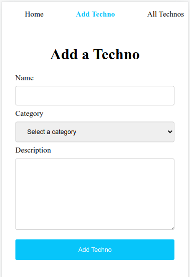
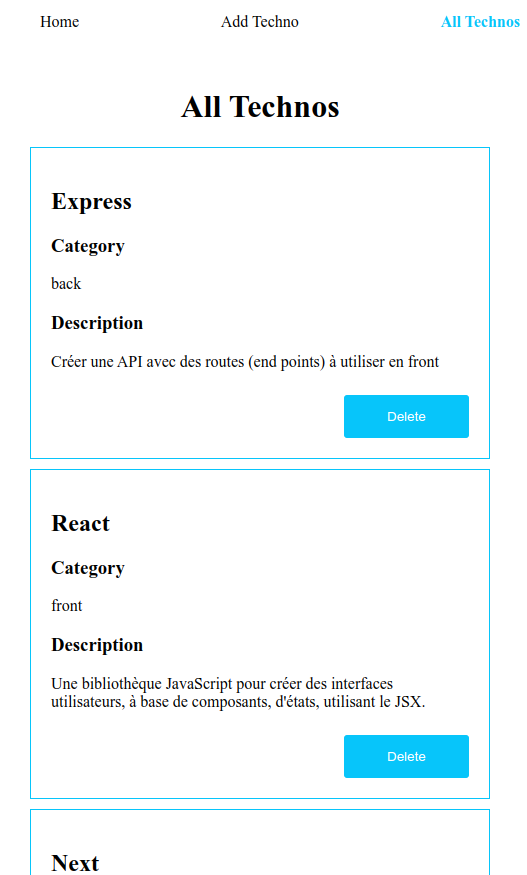
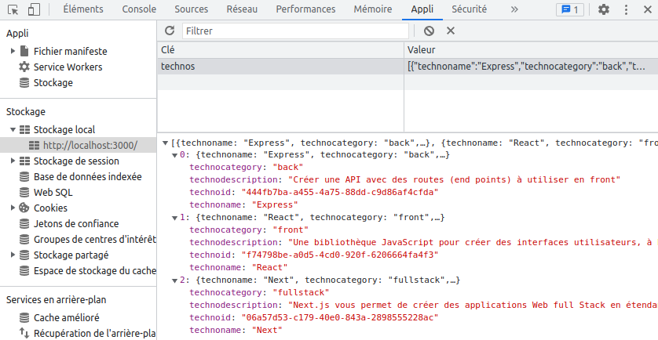

# Catalogue de technos en React

## Une application de cards avec CRUD partiel

On peut visualiser, ajouter et supprimer des cards, mais pas en modifier.

Le tout est gardé en mémoire en local storage (donc associé à un navigateur)

## Voir ce projet en action localement :
- git clone git@github.com:Tadkozh/reactcataloguetechnos.git
- npm install
- npm start
- Enjoy !
## Bibliothèques utilisées :
- [React](https://react.dev)
- [React Router DOM](https://reactrouter.com/) 
- [UUID](https://www.npmjs.com/package/uuid)
### Hook personnalisé :
- [useLocalStorage](https://usehooks.com/)
## L'occasion de revoir des fondamentaux en React :
- [CRA](https://create-react-app.dev) et une arborescence de fichiers originale
- React Router dont Active Links
- Formulaires et boutons (onSubmit/onChange, onClick)
- useState et gestion d'états
- passage de props, remontée de props et props drilling (déstructuration)
- map et uuid
- useEffect pour gérer la mise en mémoire
- hook personnalisé useLocalStorage
## Point intéressant, une méthode pour récupérer les données d'un formulaire
dans TechnoAdd, à base d'objets et de spread operator, pour gérer tous les champs en un seul handleChange : 

	function handleChange(evt) {

		const {name, value} = evt.targe

		setTechno({...techno, [name]: value })

	}
Le tout sans passer par useRef, ReactHook Form et sans avoir besoin d'un state pour chaque champs
	
Nécessite de faire l'association dans chaque champ. Exemple :

	value={techno.technodescription} 

	onChange={(evt) => handleChange(evt)}
	
## Améliorations possibles
- Utiliser [Vite](https://vitejs.dev) plutôt que [CRA](https://create-react-app.dev) (nécessiterait de créer un nouveau projet)
- Ajouter un [prettier](https://prettier.io)
- un mode sombre
- un contrôle du formulaire pour éviter d'entrer une card vide
- une manière d'organiser les cards autrement que simplement par leur ordre d'entrée (peut être par categories?)
- Ajouter des tests
- Passer en [TypeScript](https://infodocbib.net/2023/01/typescript-un-passage-oblige/)